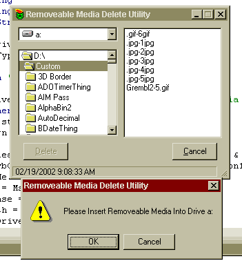



## Special Delete

### Description

Have you ever deleted a file from a floppy drive by mistake and were frustrated that you could not retrieve it from the recycle bin cause it was not there. Windows does not allow deleting to recycle bin from removeable media. This utility will copy the file from floppy to a restore folder then delete to recycle bin and remove from floppy....Now it is gone from the floppy but is in the recycle bin....Please only constructive comments. I am shareing something that may help someone as it did me.
 
### More Info
 
Select files to delete.

Deletes to the recycle bin all files selected.

             |
---                |---
**Submitted On**   |2002-02-19 09:07:32
**By**             |[TonyK](https://github.com/Planet-Source-Code/PSCIndex/blob/master/ByAuthor/tonyk.md)
**Level**          |Beginner
**User Rating**    |5.0 (35 globes from 7 users)
**Compatibility**  |VB 5\.0, VB 6\.0
**Category**       |[Complete Applications](https://github.com/Planet-Source-Code/PSCIndex/blob/master/ByCategory/complete-applications__1-27.md)
**World**          |[Visual Basic](https://github.com/Planet-Source-Code/PSCIndex/blob/master/ByWorld/visual-basic.md)
**Archive File**   |[Special\_De561492192002\.zip](https://github.com/Planet-Source-Code/tonyk-special-delete__1-31924/archive/master.zip)

### API Declarations

See Code

